```python
import math
import matplotlib.pyplot as plt
%matplotlib inline

from mpl_toolkits import mplot3d
```

# 1. Representing a (1-dimensional) curve using a single parameter `t`

Consider the three curves shown below:


  

They may be drawn in two dimensions but they are actually 1D curves. We can represent such curves using a single parameter `t` (time).

### The idea is to think of a curve as a path taken by a point. 

### The position of the point at any time `t` is given by `(x(t), y(t))` (or `z(t)` if the path exists in three dimensions).

---

# 2. Standard examples

### Circle


```python
PI = 3.1415926535
times = [i/100 for i in range(101)]

x = lambda t: math.cos(2*PI*t)
y = lambda t: math.sin(2*PI*t)

xs = [x(t) for t in times]
ys = [y(t) for t in times]

plt.figure(figsize=(4,4))
plt.plot(xs,ys)
```


    [<matplotlib.lines.Line2D at 0x7fc2a5793518>]


    
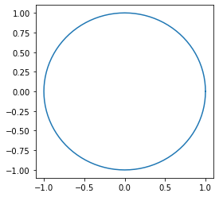
    


### Parabola


```python
times = [i/100 for i in range(-100,101)]

x = lambda t: t**2
y = lambda t: 2*t

xs = [x(t) for t in times]
ys = [y(t) for t in times]

plt.figure(figsize=(4,4))
plt.plot(xs,ys)
```


    [<matplotlib.lines.Line2D at 0x7fc2a588fe48>]


    
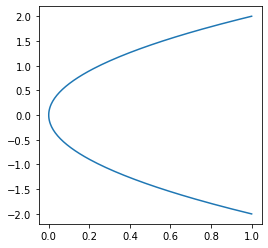
    


### Ellipse


```python
PI = 3.1415926535
times = [i/100 for i in range(101)]

x = lambda t: 6*math.cos(2*PI*t)
y = lambda t: 4*math.sin(2*PI*t)

xs = [x(t) for t in times]
ys = [y(t) for t in times]

# plt.figure(figsize=(6,6))
_ = plt.plot(xs,ys)
```


    
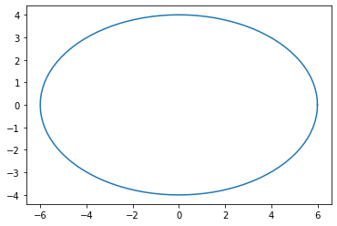
    


### Polynomial


```python
times = [i/50 for i in range(-100,201)]

x = lambda t: t
y = lambda t: 3*(1-t)**3

xs = [x(t) for t in times]
ys = [y(t) for t in times]

plt.figure(figsize=(4,4))
plt.plot(xs,ys)
```


    [<matplotlib.lines.Line2D at 0x7fc2a5b32e80>]


    
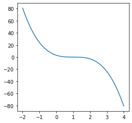
    


---

# 3. Bezier curves

We have learned two things which we will combine to understand Bezier curves:

#### 1. Polynomials can be treated as vector spaces (i.e. you can add two polynomials or multiply a scalar to a polynomial just like a vector). __They can also have different basis vectors.__

#### 2. We can represent a curve parametrically using a variable `t`. The coordinates `x`, `y`, `z` etc of a point on the curve at time `t`  are functions of the variable `t`.

Consider a basis of a quadratic polynomial:

$f_1 = (1-t)^2, \\
f_2 = 2t(1-t), \\
f_3 = t^2$

A point $(x_1, x_2, x_3)$ in this basis gives the polynomial:

$\begin{bmatrix} x_1 & x_2 & x_3 \end{bmatrix}$ $\begin{bmatrix} (1-t)^2 \\ 2t(1-t) \\ t^2 \end{bmatrix}$ = $x_1.(1-t)^2 + x_2.2t.(1-t) + x_3.t^2$

Similarly a point $(y_1, y_2, y_3)$ in this basis gives the polynomial:

$\begin{bmatrix} y_1 & y_2 & y_3 \end{bmatrix}$ $\begin{bmatrix} (1-t)^2 \\ 2t(1-t) \\ t^2 \end{bmatrix}$ = $y_1.(1-t)^2 + y_2.2t.(1-t) + y_3.t^2$

You can look at these polynomials as parametric curves i.e. you can _define_ the position of a point on the curve at time `t` along `x` and `y` axes as:

$
x(t) = x_1.(1-t)^2 + x_2.2t.(1-t) + x_3.t^2 \\
y(t) = y_1.(1-t)^2 + y_2.2t.(1-t) + y_3.t^2
$

The Bezier curve is simple `y` plotted vs `x`. The plots are shown below:


```python
B1 = lambda t: (1-t)**2
B2 = lambda t: 2*t*(1-t)
B3 = lambda t: t**2

times = [i/100 for i in range(101)]
```

#### Question: What do you think is the sum of these curves (i.e. with weights = 1 for each curve)?


```python
plt.grid()
_ = plt.plot([B1(t) for t in times], ls="--", lw=3)
_ = plt.plot([B2(t) for t in times], ls=":", lw=3)
_ = plt.plot([B3(t) for t in times], ls="-.", lw=3)
# _ = plt.plot([B1(t)+B2(t)+B3(t) for t in times])
```


    
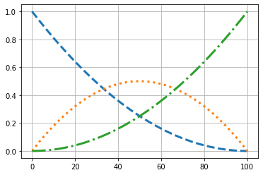
    


### $x(t) = 0.1t^2 + 1.5*2t(1-t) + 0.8*(1-t)^2$ 


```python
x_weights = [0.1, 1.5, 0.8]

plt.grid()
_ = plt.plot([B1(t) * x_weights[0] for t in times], ls="--", lw=3)
_ = plt.plot([B2(t) * x_weights[1] for t in times], ls="--", lw=3)
_ = plt.plot([B3(t) * x_weights[2] for t in times], ls="--", lw=3)

xs = [B1(t) * x_weights[0] + B2(t) * x_weights[1] + B3(t) * x_weights[2] for t in times]
_ = plt.plot(xs, lw=5)
```


    
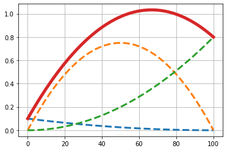
    


### $y(t) = 1.1t^2 + 0.5*2t(1-t) + 2.8*(1-t)^2$ 


```python
y_weights = [1.1, 0.5, 2.8]

plt.grid()
_ = plt.plot([B1(t) * y_weights[0] for t in times], ls="--", lw=3)
_ = plt.plot([B2(t) * y_weights[1] for t in times], ls="--", lw=3)
_ = plt.plot([B3(t) * y_weights[2] for t in times], ls="--", lw=3)
ys = [B1(t) * y_weights[0] + B2(t) * y_weights[1] + B3(t) * y_weights[2] for t in times]
_ = plt.plot(ys, lw=5)
```


    
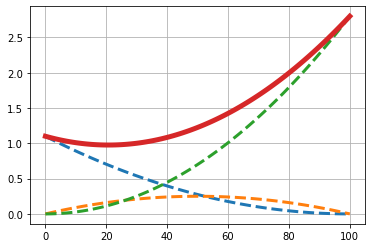
    


### Plotting `y` vs `x` gives us the Bezier curve:


```python
plt.grid()
_ = plt.plot(xs, ys, lw=3)
_ = plt.scatter(x_weights, y_weights, marker='D', c='red')
```


    
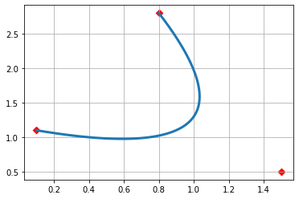
    


---

# 4. Compact representation of Bezier curves and generalization

We would like to represent the points $\begin{bmatrix} x_1 & x_2 & x_3 \end{bmatrix}$ and $\begin{bmatrix} y_1 & y_2 & y_3 \end{bmatrix}$ in _normal_ basis $\begin{bmatrix} 1 \\ t \\ t^2 \end{bmatrix}$. 

Again we use the linear transformation:

$\begin{bmatrix} (1-t)^2 \\ 2t(1-t) \\ t^2 \end{bmatrix}$ = $\begin{bmatrix} 1 & -2 & 1 \\ 0 & 2 & -2 \\ 0 & 0 & 1 \end{bmatrix} \begin{bmatrix} 1 \\ t \\ t^2 \end{bmatrix}$.

## 4.1 Generalizing to higher dimensions of points

### Thus the Bezier curve in two dimensions can be written down as:

$\begin{bmatrix} x_1 & x_2 & x_3 \\ y_1 & y_2 & y_3  \end{bmatrix} \begin{bmatrix} (1-t)^2 \\ 2t(1-t) \\ t^2 \end{bmatrix} = \begin{bmatrix} x_1 & x_2 & x_3 \\ y_1 & y_2 & y_3  \end{bmatrix} \begin{bmatrix} 1 & -2 & 1 \\ 0 & 2 & -2 \\ 0 & 0 & 1 \end{bmatrix} \begin{bmatrix} 1 \\ t \\ t^2 \end{bmatrix}$.

### Generalizing it to Bezier curve in higher dimensions is pretty straight-forward now.

Here is what the Bezier curve for three dimensions looks like:

$\begin{bmatrix} x_1 & x_2 & x_3 \\ y_1 & y_2 & y_3 \\ z_1 & z_2 & z_3  \end{bmatrix} \begin{bmatrix} (1-t)^2 \\ 2t(1-t) \\ t^2 \end{bmatrix} = \begin{bmatrix} x_1 & x_2 & x_3 \\ y_1 & y_2 & y_3 \\ z_1 & z_2 & z_3  \end{bmatrix} \begin{bmatrix} 1 & -2 & 1 \\ 0 & 2 & -2 \\ 0 & 0 & 1 \end{bmatrix} \begin{bmatrix} 1 \\ t \\ t^2 \end{bmatrix}$


```python
z_weights = [-3.1, -5.5, 0.8]

plt.grid()
_ = plt.plot([B1(t) * z_weights[0] for t in times], ls="--", lw=3)
_ = plt.plot([B2(t) * z_weights[1] for t in times], ls="--", lw=3)
_ = plt.plot([B3(t) * z_weights[2] for t in times], ls="--", lw=3)
zs = [B1(t) * z_weights[0] + B2(t) * z_weights[1] + B3(t) * z_weights[2] for t in times]
_ = plt.plot(zs, lw=5)
```


    
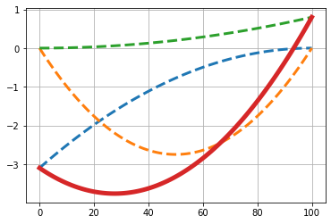
    


```python
plt.figure(figsize=(6,6))
ax = plt.axes(projection='3d')
_ = ax.plot3D(xs,ys,zs)
_ = ax.scatter3D(x_weights, y_weights, z_weights, c='red', marker='D')
```


    
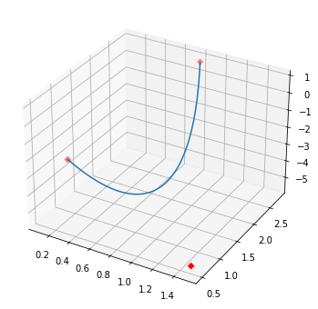
    


## 4.2 Generalizing to polynomials of higher order

We just used a polynomial of order 2 (a quadratic polynomial). For a polynomial of order 3, the basis is given by:

$\begin{bmatrix} (1-t)^3 \\ 3t(1-t)^2 \\ 3t^2(1-t) \\ t^3 \end{bmatrix}$

__Question__: do you see a pattern in how these basis vectors are calculated?

which can be written down in the _normal_ basis as:

$\begin{bmatrix} (1-t)^3 \\ 3t(1-t)^2 \\ 3t^2(1-t) \\ t^3 \end{bmatrix}$
= $\begin{bmatrix} 1 & -3 & 3 & -1 \\ 0 & 3 & -6 & 3 \\ 0 & 0 & 3 & -3 \\ 0 & 0 & 0 & 1 \end{bmatrix}$ $\begin{bmatrix} 1 \\ t \\ t^2 \\ t^3  \end{bmatrix}$

### A cubic Bezier curve in two dimensions can be written down as:

$\begin{bmatrix} x_1 & x_2 & x_3 \\ y_1 & y_2 & y_3  \end{bmatrix} \begin{bmatrix} (1-t)^3 \\ 3t(1-t)^2 \\ 3t^2(1-t) \\ t^3 \end{bmatrix} = \begin{bmatrix} x_1 & x_2 & x_3 \\ y_1 & y_2 & y_3  \end{bmatrix} \begin{bmatrix} 1 & -3 & 3 & -1 \\ 0 & 3 & -6 & 3 \\ 0 & 0 & 3 & -3 \\ 0 & 0 & 0 & 1 \end{bmatrix} \begin{bmatrix} 1 \\ t \\ t^2 \\ t^3  \end{bmatrix}$

### and in three dimensions it simply looks like:

$\begin{bmatrix} x_1 & x_2 & x_3 \\ y_1 & y_2 & y_3 \\ z_1 & z_2 & z_3  \end{bmatrix} \begin{bmatrix} (1-t)^3 \\ 3t(1-t)^2 \\ 3t^2(1-t) \\ t^3 \end{bmatrix} = \begin{bmatrix} x_1 & x_2 & x_3 \\ y_1 & y_2 & y_3 \\ z_1 & z_2 & z_3  \end{bmatrix} \begin{bmatrix} 1 & -3 & 3 & -1 \\ 0 & 3 & -6 & 3 \\ 0 & 0 & 3 & -3 \\ 0 & 0 & 0 & 1 \end{bmatrix} \begin{bmatrix} 1 \\ t \\ t^2 \\ t^3  \end{bmatrix}$


```python
B1 = lambda t: (1-t)**3
B2 = lambda t: 3 * t * ((1-t)**2)
B3 = lambda t: 3 * (t**2) * (1-t)
B4 = lambda t: t**3

times = [i/100 for i in range(101)]
```


```python
plt.grid()
_ = plt.plot([B1(t) for t in times], ls="--", lw=3)
_ = plt.plot([B2(t) for t in times], ls="-.", lw=3)
_ = plt.plot([B3(t) for t in times], ls="-.", lw=3)
_ = plt.plot([B4(t) for t in times], ls="--", lw=3)
```


    
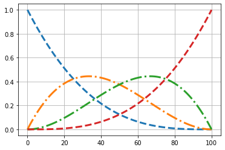
    


```python
x_weights = [0.1, 1.5, 0.8, -2]
xs = [B1(t) * x_weights[0] + B2(t) * x_weights[1] + B3(t) * x_weights[2] + B4(t) * x_weights[3] for t in times]

y_weights = [2.1, 3.5, -3.8, 2]
ys = [B1(t) * y_weights[0] + B2(t) * y_weights[1] + B3(t) * y_weights[2] + B4(t) * y_weights[3] for t in times]

z_weights = [-3.1, 1.5, 7.8, -5]
zs = [B1(t) * z_weights[0] + B2(t) * z_weights[1] + B3(t) * z_weights[2] + B4(t) * z_weights[3] for t in times]
```


```python
plt.grid()
_ = plt.scatter(x_weights, y_weights, c='red', marker='D')
_ = plt.plot(xs, ys)
```


    
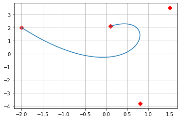
    


```python
plt.figure(figsize=(6,6))
ax = plt.axes(projection='3d')
_ = ax.plot3D(xs,ys,zs)
_ = ax.scatter3D(x_weights, y_weights, z_weights, c='red', marker='D')
```


    
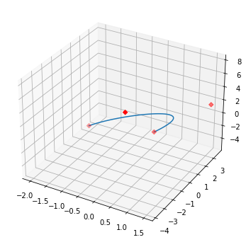
    


---

# 5. Geometric properties of Bezier curve

## 5.1 The curve interpolates (i.e. exactly passes through) the end points and approximates (i.e. does not pass through) the remaining points


```python
plt.grid()
_ = plt.scatter(x_weights, y_weights, c='red', marker='D')
_ = plt.plot(xs, ys)
```


    

    


## 5.2 The curve always lies inside the convex hull of the specified points


```python
plt.grid()
_ = plt.scatter(x_weights, y_weights, c='red', marker='D')
plt.arrow(x_weights[-1], y_weights[-1], x_weights[1]-x_weights[-1], y_weights[1]-y_weights[-1])
plt.arrow(x_weights[2], y_weights[2], x_weights[1]-x_weights[2], y_weights[1]-y_weights[2])
plt.arrow(x_weights[-1], y_weights[-1], x_weights[2]-x_weights[-1], y_weights[2]-y_weights[-1])
_ = plt.plot(xs, ys)
```


    
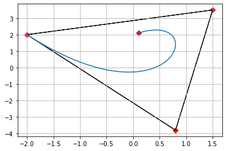
    


## 5.3 The gradient of the curve at first point is in the direction of first point to second point. Similar the gradient of the curve at last point is in the direction of last point to second last point.


```python
plt.grid()

_ = plt.arrow(x_weights[0], y_weights[0], x_weights[1]-x_weights[0], y_weights[1]-y_weights[0], head_width=0.3)
_ = plt.arrow(x_weights[-1], y_weights[-1], x_weights[-2]-x_weights[-1], y_weights[-2]-y_weights[-1], head_width=0.3)
_ = plt.scatter(x_weights, y_weights, c='red', marker='D')
_ = plt.plot(xs, ys)


```


    
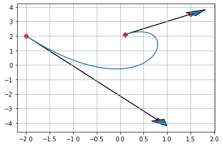
    


```python

```


```python

```
